# Deeper Seeker

## Overview
The **Deeper Seeker** is an open-source research tool similar to perplexity pro , designed to perform tasks like comprehensive market research, competitor analysis, and investment memo preparation. Building on the foundation of the previous version, **Deeper Seeker V2.0.0** introduces significant improvements in research logic, web search capabilities, and report generation. The tool is designed to:
- Conduct iterative research with continuous refinement.
- Generate structured search queries and analyze results.
- Produce well-formatted, actionable reports with inline citations.

---




```mermaid
graph TD;
    %% Start and Initial Steps
    A[Start] -->|User Input| B[Run Follow-Up Loop]
    B -->|Generate Follow-Up Questions| C[Follow-Up Interaction]
    C -->|User Responds| D[Update Context]
    D -->|Check Iterations| D1{More Iterations?}

    D1 -- Yes --> B
    D1 -- No --> E[Generate Research Plan]

    %% Research Plan and Multi-Step Execution
    E -->|Break into Steps| F[Research Plan Steps]
    
    subgraph Research Execution
        direction TB;
        F -->|Step 1: Topic Exploration| S1[Generate Queries for Step 1]
        S1 -- Query 1 --> Q11[Fetch Results for Query 1]
        S1 -- Query 2 --> Q12[Fetch Results for Query 2]
        S1 -- Query 3 --> Q13[Fetch Results for Query 3]

        F -->|Step 2: Competitive Analysis| S2[Generate Queries for Step 2]
        S2 -- Query 1 --> Q21[Fetch Results for Query 1]
        S2 -- Query 2 --> Q22[Fetch Results for Query 2]
        S2 -- Query 3 --> Q23[Fetch Results for Query 3]

        F -->|Step 3: Market Trends| S3[Generate Queries for Step 3]
        S3 -- Query 1 --> Q31[Fetch Results for Query 1]
        S3 -- Query 2 --> Q32[Fetch Results for Query 2]
        S3 -- Query 3 --> Q33[Fetch Results for Query 3]
    end

    %% Processing and Report Generation
    Q11 --> P[Process Search Results]
    Q12 --> P
    Q13 --> P
    Q21 --> P
    Q22 --> P
    Q23 --> P
    Q31 --> P
    Q32 --> P
    Q33 --> P

    P -->|Aggregate Learnings| J[Extract Insights & Learnings]
    J -->|Refine Content| K[Generate Final Report]
    K -->|Format in Markdown| L[Save Report as final_report.md]
    
    L --> Z[End]

    %% Styling
    style A fill:#f9f,stroke:#333,stroke-width:2px;
    style Z fill:#f9f,stroke:#333,stroke-width:2px;
    classDef parallel fill:#ff9,stroke:#333,stroke-width:2px;
    class S1,S2,S3,Q11,Q12,Q13,Q21,Q22,Q23,Q31,Q32,Q33 parallel;
```

## Key Features
1. **Iterative Research Workflow:**
   - Plans research steps based on user queries.
   - Generates precise search queries using the Exa API.
   - Continuously refines research based on findings.
   - Parallel execution of steps and search queries.

2. **Structured Output:**
   - Produces JSON-structured search queries for API calls.
   - Formats search results with highlights, citations, and summaries.

3. **Comprehensive Reporting:**
   - Synthesizes research findings into actionable reports using Google Gemini.

4. **Multi-Model Support:**
   - Utilizes multiple AI models (e.g., OpenAI, Groq, Google Gemini) for reasoning, planning, and report generation.

---

## How It Works
1. **User Query:**
   - The user provides a research query (e.g., "Analyze the global EV market in 2024").

2. **Follow-Up Questions:**
   - The tool generates follow-up questions to refine the research scope and context.

3. **Research Planning:**
   - The AI creates a detailed research plan, breaking the query into logical steps.Each step leads to multi-query search.

4. **Search Execution:**
   - The tool generates specific search queries for each step and uses the Exa API to search the web for relevant information.
   - Parallel execution of search queries to reduce the latency.

5. **Result Processing:**
   - Search results are processed, formatted, and analyzed.

6. **Final Report:**
   - All findings are synthesized into a comprehensive, well-formatted report using Google Gemini.

---

## Installation
1. Clone the repository:
   ```bash
   git clone https://github.com/HarshJ23/Deeper-Seeker.git
   cd Deeper-Seeker
   ```

2. Install dependencies:
   ```bash
   pip install -r requirements.txt
   ```

3. Set up environment variables:
   - Create a `.env` file and add your API keys:
     ```
     EXA_API_KEY=your_exa_api_key
     OPENAI_API_KEY=your_openai_api_key
     GROQ_API_KEY=your_groq_api_key
     GEMINI_API_KEY=your_gemini_api_key
     ```

---

## Usage
1. Run the script:
   ```bash
   python app.py
   ```

2. Enter your research query when prompted:
   ```
   Enter your query: Analyze the competitive landscape of the cloud computing industry.
   ```

3. View the research process and final report:
   - The tool will display reasoning, plans, search results, and link counts for each iteration.
   - The final report will be saved as `final_report.md`.

---

## Example Queries
Here are some sample queries to test the tool:
1. **Market Research:**
   - "Provide an overview of the global electric vehicle (EV) market in 2024."
   - "What are the current trends in the plant-based food industry?"

2. **Competitor Analysis:**
   - "Compare Tesla and Rivian in terms of market share and product offerings."
   - "Analyze the competitive landscape of the cloud computing industry."

3. **Investment Memo Prep:**
   - "Prepare a brief investment memo for a fintech startup specializing in blockchain-based payments."
   - "Evaluate the investment potential of the renewable energy sector."

---

## Code Structure
- `app.py`: Main script for running the research assistant.
- `generate_followup()`: Function to generate follow-up questions based on user input.
- `generate_research_plan()`: Function to create a structured research plan.
- `generate_queries_for_step()`: Function to generate search queries for each research step.
- `execute_plan()`: Function to execute the research plan and fetch search results.
- `generate_report()`: Function to generate a detailed report using Google Gemini.

---

## Dependencies
- Python 3.11+
- Libraries:
  refer ```requirements.txt``` file

---

## Configuration
- **Exa API Key**: Required for web search functionality. Sign up at [Exa AI](https://exa.ai/).
- **OpenAI API Key**: Required for AI reasoning and planning. Sign up at [OpenAI](https://platform.openai.com/).
- **Groq API Key**: Required for using Groq's AI models. Sign up at [Groq](https://groq.com/).
- **Google Gemini API Key**: Required for report generation. Sign up at [Google Cloud](https://cloud.google.com/).

---

## Contributing
Contributions are welcome! Please follow these steps:
1. Fork the repository.
2. Create a new branch for your feature or bugfix.
3. Submit a pull request with a detailed description of your changes.

---

## Future Enhancements

- **In progress**
    - Enhancing the overall workflow (reasoning,websearch and writing components).
    - Text pre-processing of extracted learnings to remove noise.


- **Later Stage Additions:**
  - FastAPI endpoint.
  - Support for multiple models.
  - frontend UI
  - Support for multiple model providers.
  - Database integration.


---

Happy researching! 🚀